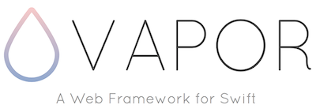
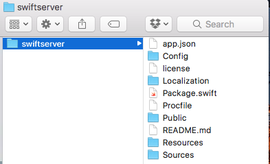
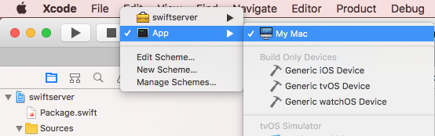
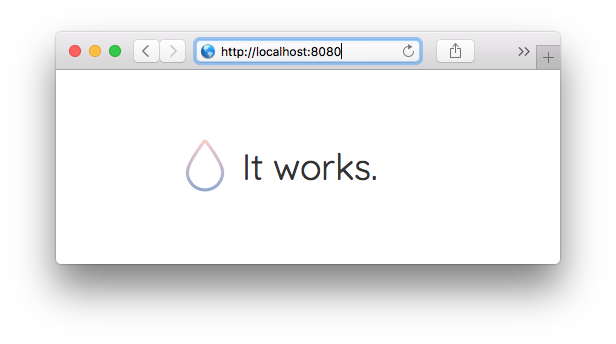
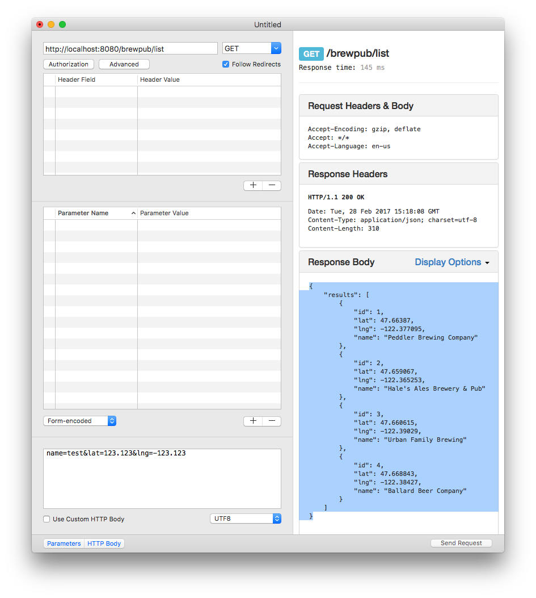
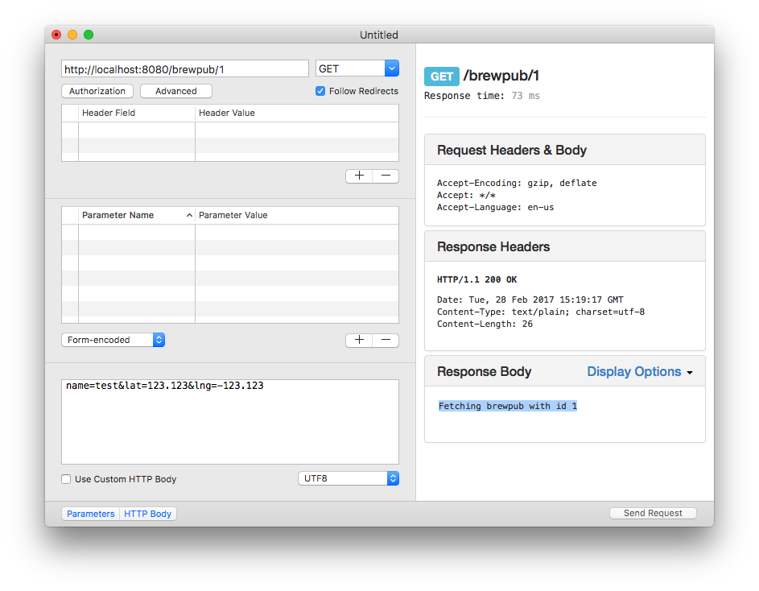
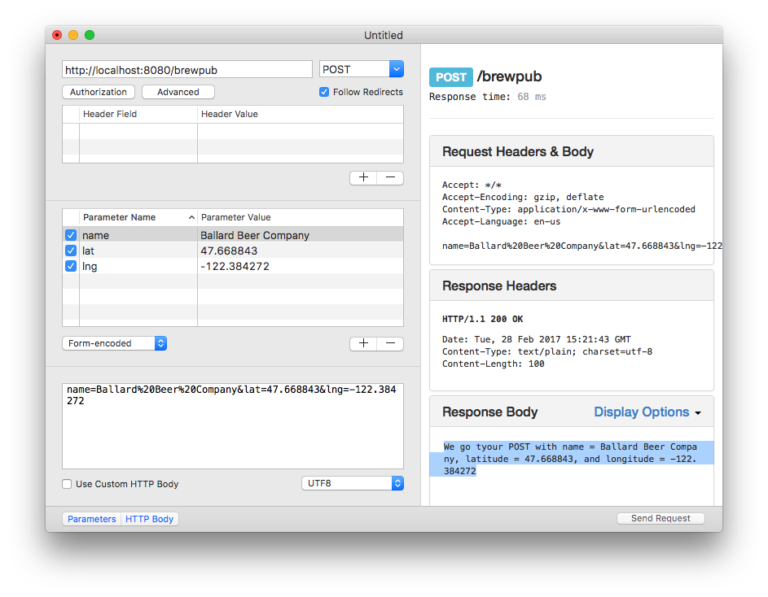
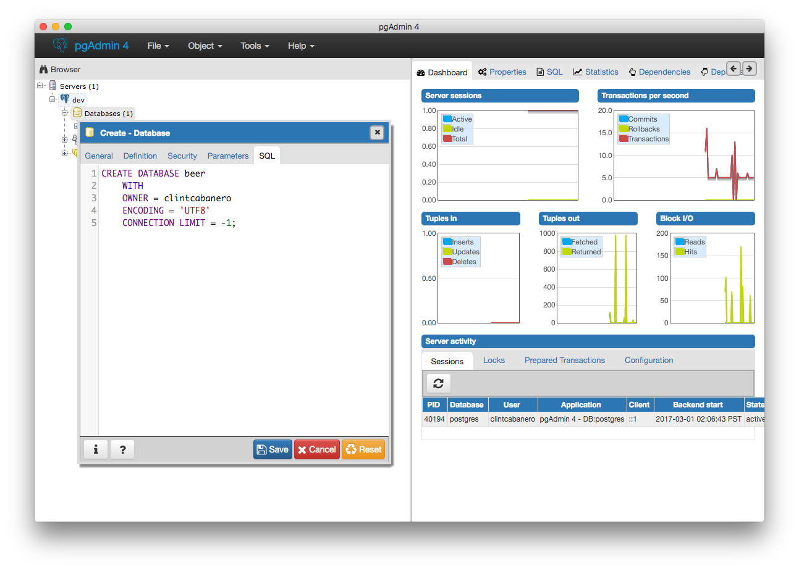
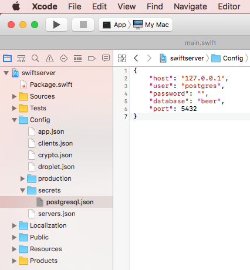
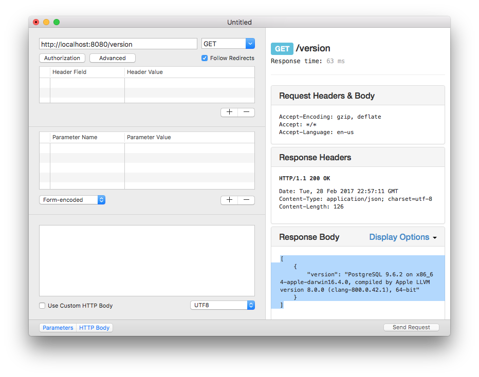

# Server Side Swift

Server Side __Swift__ code snippets using __Vapor__. 




##Setup your Development Environment

On macOS, download Xcode 8.  We will use Swift 3, the latest Swift Package Manager, and the IDE that comes with Xcode.

Open Terminal and verfiy the Xcode install with:

````
curl -sL check.vapor.sh | bash
````

We will use the Vapor Command Line Interface called __Toolbox__ to create, manage, and deploy our Swift Server projects that are powered by Vapor.  

In Terminal, install the Vapor Toolbox with:

````
curl -sL toolbox.vapor.sh | bash
````

Confirm that the install of Vapor Toolbox with:

````
vapor --help
````

Then tell the Vapor Toolbox it should update itself in the future with:

````
vapor self update
````

##Create a New Vapor Project

In Terminal, use Toolbox to create a new Vapor Project called 'swiftserver' with:

````
cd ~/Desktop
vapor new swiftserver
````

Observe that the Vapor Toolbox scaffolds a Project folder structure for us (see below):



Now, let's create an Xcode project so that we can view and maintain our project files using the Xcode IDE.  

In Terminal, go into the root of your project directory and create an Xcode project with:

````
cd swiftserver
vapor xcode
````

When prompted to open the Xcode project go ahead and do so.  

Review the directory structure of the Project - explained here in the [Vapor Docs](https://vapor.github.io/documentation/guide/folder-structure.html). Examine the following files in particular:

* /Package.swift
* /Sources/App/main.swift

Before moving forward, run the Vapor project to make sure everything works.  In Xcode, choose the *App* target and Run (see below):



Open a web browser and navigate to http://localhost:8080 . You should see it works ...



##Routing Basics

In this section, we're going to send some static JSON through a route.  Along the way we'll learn some routing basics such as how to handle simple GET and POST requests.

In Xcode, navigate to /Sources/App/Main.swift and edit it as:

````
import Vapor

let drop = Droplet()

drop.get { request in
    
    return try drop.view.make("welcome", [
        "message": drop.localization[request.lang, "welcome", "title"]
        ])
}

// handles GET /welcome
drop.get("welcome") { request in
    
    return "sup"
}

// handles GET /brewpub/list
drop.get("brewpub/list") { request in
    
    var brewpub1 = JSON([
        "id": 1,
        "name": "Peddler Brewing Company",
        "lat": 47.663870,
        "lng": -122.377095
        ])
    var brewpub2 = JSON([
        "id": 2,
        "name": "Hale's Ales Brewery & Pub",
        "lat": 47.659067,
        "lng": -122.365253
        ])
    var brewpub3 = JSON([
        "id": 3,
        "name": "Urban Family Brewing",
        "lat": 47.660615,
        "lng": -122.39029
        ])
    var brewpub4 = JSON([
        "id": 4,
        "name": "Ballard Beer Company",
        "lat": 47.668843,
        "lng": -122.38427
        ])
    
    var jsonResponse = JSON([:])
    jsonResponse["results"] = JSON([brewpub1, brewpub2, brewpub3, brewpub4])
    
    return try JSON(node: jsonResponse)
}

// handles GET /brewpub/id (e.g. /brewpub/1)
drop.get("brewpub", Int.self) { request, id in
    
    return "Fetching brewpub with id \(id)"
}

// handles POST /brewpub
drop.post("brewpub") { request in
    
    guard let name = request.data["name"]?.string else {
        throw Abort.badRequest
    }
    guard let lat = request.data["lat"]?.double else {
        throw Abort.badRequest
    }
    guard let lng = request.data["lng"]?.double else {
        throw Abort.badRequest
    }
    
    return "We got your POST with name = \(name), latitude = \(lat), and longitude = \(lng)"
}

drop.resource("posts", PostController())

drop.run()
````
In Xcode, run the App.  

Using your favorite HTTP client (e.g. web browser, [RESTed](https://itunes.apple.com/us/app/rested-simple-http-requests/id421879749?mt=12), [Postman](https://www.getpostman.com)), view the responses from the different routes. 

When we GET request __http://localhost:8080/brewpub/list__ we see the JSON response of brewpubs (see below):


When we GET request __http://localhost:8080/brewpub/1__ we see a message that processes the input Id (i.e. integer of 1).  Note, in a future section we will use this Id to look up a brewpub from the database and return that brewpub's data in a JSON response.


When we POST request __http://localhost:8080/brewpub__ we see a message that processes the passed in parameters.  Note, in a future section we will use the input parameter data to create a new brew pub record in the database and return a status message (e.g. success) in the response.


At this point, play with Routing with Vapor.  Here are some relevant sections of the docs to get started:

* [Routing Basics](https://vapor.github.io/documentation/routing/basic.html)
* [Route Parameters](https://vapor.github.io/documentation/routing/parameters.html)
* [Query Parameters](https://vapor.github.io/documentation/routing/query-parameters.html)

##Create an API

In this section we are going to create a RESTful web service that will allow client Apps to fetch a collection of Brew Pubs.  We will also allow our client Apps to create new Brew Pubs and update existing ones.  We'll refer to this as the BrewPub API.  Being a RESTful web service, we will later demonstrate how to consume this data in multiple platforms such as Apple (iOS, watchOS, tvOS, macOS), Android apps, and Web apps.

The data will be persisted in a PostgreSQL database.  We will debug/develop locally.  In the next section we will deploy this to a Cloud service (e.g. Heroku).

#### Step 1: Install PostgreSQL on macOS

We will install PostgreSQL on our Mac using Homebrew.  

If you *don't* have Homebrew, use Terminal to install [Homebrew](https://brew.sh) with:

````
/usr/bin/ruby -e "$(curl -fsSL https://raw.githubusercontent.com/Homebrew/install/master/install)"
````

If you *do* have Homebrew installed on your Mac, then its a good practice to always update before installing anything with:

````
brew update
````

Then, verify the Homebrew installation with:

````
brew help
````

Install PostgreSQL with:

````
brew install postgresql
````

Create a new database cluster with:

````
initdb /usr/local/var/postgres -E utf8
````

Create a postgres user:

````
/usr/local/Cellar/postgresql/<version>/bin/createuser -s postgres
e.g.
/usr/local/Cellar/postgresql/9.6.2/bin/createuser -s postgres
````

Start Postgresql with:

````
brew services start postgresql
````

If you prefer to work with PostgreSQL using a database GUI, then install [PgAdmin](https://www.pgadmin.org/download/macos4.php).  This quick-start will use PgAdmin.

Open pgAdmin, create a server and connect with:

* host: localhost 
* user name: postgres

Create a __beer__ database. Your pgAdmin UI should resemble the following:




#### Step 2: Configure the Vapor Project to Connect to your PostgreSQL Database

In Xcode, edit the __Package.swift__ file to add the PostgreSQL provider for Vapor as a dependency.  See below:

````
import PackageDescription

let package = Package(
    name: "swiftserver",
    dependencies: [
        .Package(url: "https://github.com/vapor/vapor.git", majorVersion: 1, minor: 5),
        .Package(url: "https://github.com/vapor/postgresql-provider", majorVersion: 1, minor: 0)
    ],
    exclude: [
        "Config",
        "Database",
        "Localization",
        "Public",
        "Resources",
    ]
)

````

After saving changes to the Package.swift file have Vapor re-build and re-create the Xcode project.  This will download the new dependencies.

````
vapor xcode
````

In Xcode, edit the /Sources/App/main.swift file to:

* Add an import VaporPostgreSQL statement.
* Add a provider to the Droplet instance.
* Create a new route that will test connecting to your local development database and responding with the PostgreSQL version.  See below:

````
import Vapor
import VaporPostgreSQL // ADDED

let drop = Droplet()
try drop.addProvider(VaporPostgreSQL.Provider.self) //ADDED

// ADDED route
drop.get("version") { request in
    
    if let db = drop.database?.driver as? PostgreSQLDriver {
        let version = try db.raw("SELECT version()")
        return try JSON(node: version)
    }
    else {
        return "No db connection"
    }
}

// handles GET /welcome
drop.get("welcome") { request in
    
    return "sup"
}
...

````

In your Xcode project, create a __secrets__ folder under the /Config folder.

In the secrets folder, add the following configuration file so that the app can connect to your local PostgreSQL database.  See below:

 

Run Xcode, use a HTTP client (e.g. RESTed) to confirm the Vapor Project can connect to your PostgreSQL database.



#### Step 3: Create a BrewPub Model

Create a new BrewPub.swift file and add it to /Sources/App/Models

Implement the BrewPub model.  Note that this model class must conform to the Model, NodeInitializable, NodeRepresentable, and Preparation protocols. See below:

````
import Foundation
import Vapor

final class BrewPub: Model {
    
    // required by Model protocol
    var id: Node?
    var exists: Bool = false
    
    var name: String
    var latitude: Double
    var longitude: Double
    
    // convenience initializer
    init(name: String, latitude: Double, longitude: Double) {
        self.id = nil
        self.name = name
        self.latitude = latitude
        self.longitude = longitude
    }
    
    // required by NodeInitializable protocol
    init(node: Node, in context: Context) throws {
    
        id = try node.extract("id")
        name = try node.extract("name")
        latitude = try node.extract("latitude")
        longitude = try node.extract("longitude")
    }
    
    // required by NodeRepresentable protocol
    func makeNode(context: Context) throws -> Node {
        return try Node(node: [
            "id": id,
            "name": String,
            "latitude": Double,
            "longitude": Double
        ])
    }
    
    // for creating the database table for this model
    static func prepare(_ databse: Database) throws {
        try database.create("brewpubs") { pubs in
            pubs.id()
            pubs.string("name")
            pubs.double("latitude")
            pubs.double("longitude")
        }
    }
    
    // for deleting the database table
    static func revert(_ database: Database) throws {
        try database.delete("brewpubs")
    }
}
````
After implementing a model class, update the Droplet instance preparatiosn collection.  In /Sources/App/main.swift update as:

````
import Vapor
import VaporPostgreSQL

let drop = Droplet()
drop.preparations.append(BrewPub.self) // ADDED
try drop.addProvider(VaporPostgreSQL.Provider.self)

````


#### Step 4: Create the BrewPub Routes

*In Progress*

##Deploy to Cloud Service

You can deploy your Vapor-powered Swift Server to many cloud services.  In this section we use Heroku.

#### Step 1: Sign Up for [Free Heroku Account here](https://www.heroku.com)

#### Step 2: Install the Heroku Command Line Interface (CLI)

Now, install the [Heroku Command Line Interface (CLI)](https://devcenter.heroku.com/articles/heroku-cli) with:

````
brew install heroku
````
Then, confirm the Heroku CLI installation with:

````
heroku --version
````

#### Step 3: Deploy to Heroku

If your Vapor project is not yet under source control, create a local git repository for it using the following in Terminal:

````
git init
git add -A
git commit -m 'a message about your commit'
````

In Terminal, login to Heroku using the Heroku CLI with the following:  

````
heroku login
````

When prompted, enter your Heroku account credentials.

Next, deploy your Vapor app to Heroku with the following:

````
vapor heroku init
````

Answer all the prompts (e.g. App Name). 

Over time, you will maintain the code in your Vapor project. To upload your changes made back up to Heroku do the following:

````
git commit -A
git commit -m 'a message about your commit'
git push heroku master
````

##Use the Published BrewPub API in Client Apps

*iOS In Progress*

*watchOS In Progress*

*tvOS In Progress*

*Android In Progress*

*Web In Progress*

##Connect

* Twitter: [@clintcabanero](http://twitter.com/clintcabanero)
* GitHub: [ccabanero](http:///github.com/ccabanero)
