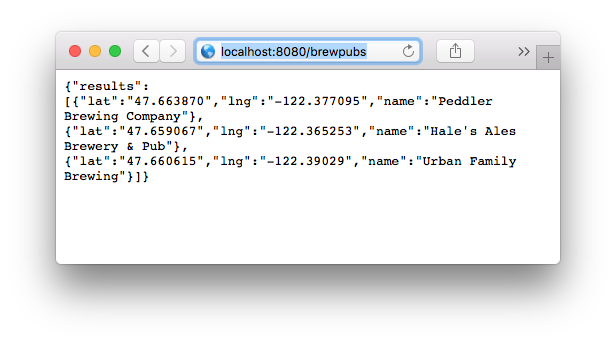

# Server Side Swift with Vapor

Server Side __Swift__ code snippets using __Vapor__.


##Setup your Development Environment

On macOS, download Xcode 8.  We will use Swift 3, the latest Swift Package Manager, and the IDE that comes with Xcode.

Open Terminal and verfiy the Xcode install with:

````
curl -sL check.vapor.sh | bash
````

We will use the Vapor Command Line Interface called __Toolbox__ to create and manage our Swift Server projects that are powered by Vapor.  

In Terminal, install the Vapor Toolbox with:

````
curl -sL toolbox.vapor.sh | bash
````

Confirm that the install of Vapor Toolbox with:

````
vapor --help
````

Then tell the Vapor Toolbox it should update itself in the future with:

````
vapor self update
````

##Create a New Vapor Project

In Terminal, use Toolbox to create a new Vapor Project called 'swiftserver' with:

````
cd ~/Desktop
vapor new swiftserver
````

Observe that the Vapor Toolbox scaffolds a Project folder structure for us (see below):


Now, let's create an Xcode project so that we can view and maintain our project files using the Xcode IDE.  

In Terminal, go into the root of your project directory and create an Xcode project with:

````
cd swiftserver
vapor xcode
````

When prompted to open the Xcode project go ahead and do so.  Examine the following files in particular:

* /Package.swift
* /Sources/App/main.swift

Review the directory structure of the Project - explained here in the [Vapor Docs](https://vapor.github.io/documentation/guide/folder-structure.html).

Before moving forward, run the Vapor project to make sure everything works.  In Xcode, choose the *App* target and Run (see below):


Open a web browser and navigate to http://localhost:8080 . You should see it works ...


##Quick and Dirty

In this section, we're going to send some static JSON through a URL (i.e. route).

In Xcode, navigate to /Sources/App/Main.swift and edit it as:

````
import Vapor

let drop = Droplet()

drop.get { req in
    return try drop.view.make("welcome", [
    	"message": drop.localization[req.lang, "welcome", "title"]
    ])
}

// Add This ...
drop.get("brewpubs") { req in
    
    var brewpub1 = JSON([
        "name": "Peddler Brewing Company",
        "lat": "47.663870",
        "lng": "-122.377095"
        ])
    var brewpub2 = JSON([
        "name": "Hale's Ales Brewery & Pub",
        "lat": "47.659067",
        "lng": "-122.365253"
        ])
    var brewpub3 = JSON([
        "name": "Urban Family Brewing",
        "lat": "47.660615",
        "lng": "-122.39029"
        ])
    
    var jsonResponse: JSON = JSON([:])
    jsonResponse["results"] = JSON([brewpub1, brewpub2, brewpub3])
    
    return try JSON(node: jsonResponse)
}

drop.resource("posts", PostController())

drop.run()
````
In Xcode, re-run the App.  Open your browser and navigate to [http://localhost:8080/brewpubs](http://localhost:8080/brewpubs).  You should see the JSON sent as a response.



##Create a RESTful Web Service

In this section we are going to create a RESTful web service that will allow client Apps (iOS, Android, or Web) to fetch a collection of Brew Pubs in Seattle, WA.  We will also allow our client Apps to create new Brew Pubs and update existing ones.  The data will be persisted in a PostgreSQL database.  We will debug/develop locally.  In the next section we will deploy this to a Cloud service (e.g. Heroku).

##### Step 1: Create a BrewPub Model

*In Progress*

##### Step 2: Create a BrewPub Route

*In Progress*

##### Step 3: Consume the BrewPub endpoint in client App(s)

*In Progress*

##Deploy the Swift Server Project to Heroku

You can deploy your Vapor-powered Swift Server to many cloud services.  In this section we use Heroku.

#####Step 1: Sign Up for [Free Heroku Account here](https://www.heroku.com)

#####Step 2: Install the Heroku Command Line Interface (CLI)

In Terminal, first install [Homebrew](https://brew.sh) with:

````
/usr/bin/ruby -e "$(curl -fsSL https://raw.githubusercontent.com/Homebrew/install/master/install)"
````

Then, confirm the Homebrew installation with:

````
brew help
````

Now, install the [Heroku Command Line Interface (CLI)](https://devcenter.heroku.com/articles/heroku-cli)

````
brew install heroku
````
Then, confirm the Heroku CLI installation with:

````
heroku --version
````

####Step 3: Use Vapor to Deploy to Heroku

In Terminal, use the Heroku CLI to login with:

If your Vapor project is not yet under source control, create a local git repository for it using the following in Terminal:

````
git init
git add -A
git commit -m 'a message about your commit'
````

In Terminal, login to Heroku using the Heroku CLI with the following:  

````
heroku login
````

When prompted, enter your Heroku account credentials.

Next, deploy your Vapor app to Heroku with the following:

````
vapor heroku init
````

You will be prompted for providing an Heroku App Name.  After providing a unique name, it will provide you with your App's URL.  Proceed by answering the rest of the prompts.

Over time, you will maintain the code in your Vapor project. To upload changes made to your code back up to Heroku do the following:

````
git commit -A
git commit -m 'a message about your commit'
git push heroku master
````

That's all there is to it!!! :)

##Connect

* Twitter: [@clintcabanero](http://twitter.com/clintcabanero)
* GitHub: [ccabanero](http:///github.com/ccabanero)
